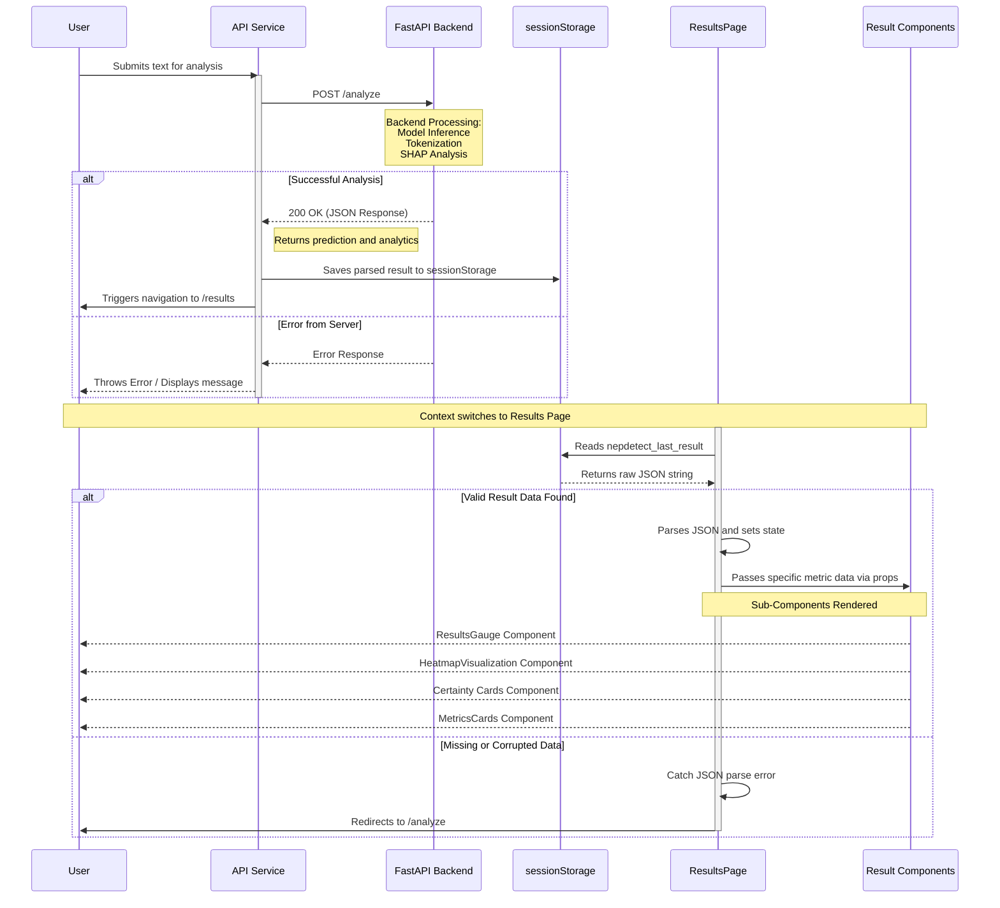

# Frontend-Backend Integration Sequence Diagram

The following Mermaid sequence diagram illustrates the communication flow directly from the perspective of the API service layer, browser session storage, and how results are consumed to seamlessly interact with the backend.

