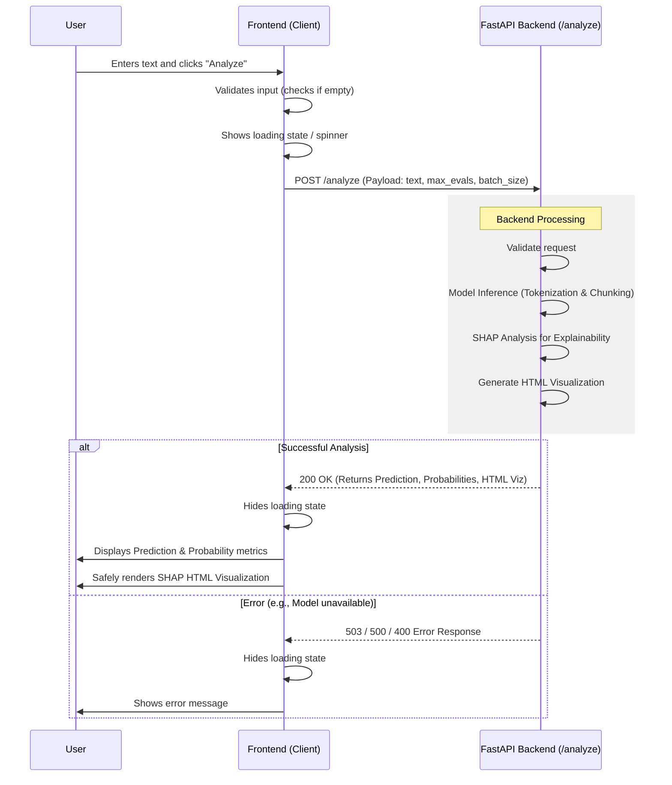

# Flow and API Specification for NepDetect Frontend-Backend Integration

This document outlines the interaction between a separate frontend client and the NepDetect FastAPI backend. It includes a sequence diagram detailing the flow of data, as well as the complete API specifications required to seamlessly build and integrate the frontend.

## Sequence Diagram

The following Mermaid sequence diagram illustrates the communication flow when a user submits text for analysis.



## API Specifications

The FastAPI backend natively exposes the following endpoints.

### 1. Analysis Endpoint

- **URL:** `/analyze`
- **Method:** `POST`
- **Description:** Analyzes the provided text to determine whether it is Human or AI-written. It returns prediction details along with a SHAP-based HTML visualization explaining the output.

#### Request Body
The request expects a JSON body with the following structure:
```json
{
  "text": "The input text to be evaluated by the model.",
  "max_evals": 250,      // Optional: Defaults to 250. Higher = more accurate SHAP, but slower.
  "batch_size": 8        // Optional: Defaults to 8. Number of chunks to process simultaneously.
}
```

#### Response Body
A successful response returns a JSON object with the following structure:
```json
{
  "prediction": "AI",                                // String: Predicted class ("Human" or "AI")
  "probability": 0.89,                               // Float: Peak probability of the predicted class
  "probabilities": {                                 // Object: Probabilities mapping for all classes
    "Human": 0.11,
    "AI": 0.89
  },
  "certainties": {                                   // Object: SHAP-based certainty scores
    "Human": 0.05,
    "AI": 0.95
  },
  "tokens_count": 142,                               // Integer: Total number of tokens in the evaluated text
  "chunks_count": 1,                                 // Integer: Number of chunks processed
  "html_viz": "<div style=\"...\">...</div>"         // String: Raw HTML for SHAP explainability viz
}
```

### 2. Health Check Endpoint

- **URL:** `/health`
- **Method:** `GET`
- **Description:** Checks if the classification model and tokenizer are successfully loaded into memory and the API is ready to accept requests.

#### Response Body
```json
{
  "status": "healthy",
  "device": "cuda" // or "cpu"
}
```

## Frontend Implementation Guidelines

When handing this over to an AI agent or a frontend developer, keep the following guidelines in mind:

1. **CORS Handling:** The backend is configured with `CORSMiddleware` containing `allow_origins=["*"]`, so cross-origin requests from any frontend development server configuration (like localhost:3000 or localhost:5173) will work perfectly without any preflight errors.
2. **Rendering HTML Visualizations:** The `html_viz` string returned within the `POST /analyze` response contains raw HTML with inline CSS. To reflect this correctly on the frontend (e.g., in React, Vue, or Svelte), you will need to cleanly inject this HTML string. In React, use `dangerouslySetInnerHTML`. It's a self-contained widget.
3. **Loading States are Crucial:** The POST request to `/analyze` performs heavyweight model inference and SHAP computations. It will take measurable time to complete and respond (especially on longer texts processing on a CPU). Ensure the frontend features a clear loading overlay or spinner.
